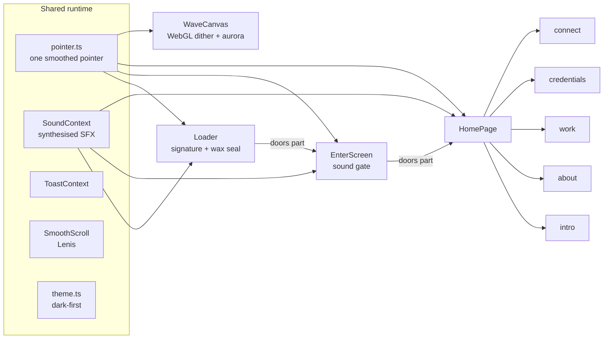

<div align="center">


# Sambit Swain

### A monochrome maison of motion — signature loader, dithered WebGL ink, and a site that answers back.

**[ LIVE DEMO ](https://ssambit635-svg.github.io/portfolio.site/)** · **[ PROJECTS ](#-the-work)** · **[ ARCHITECTURE ](#-architecture)** · **[ RUN IT ](#-run-it)**

_Every frame is hand-tuned. No animation libraries for the showpieces — just SVG geometry, one WebGL shader, and Web Audio synthesis._

</div>

---

<div align="center">


</div>

---

## The thirty-second tour

|  #  | Beat              | What happens                                                                                                                                                                                                                                                   |
| :-: | ----------------- | -------------------------------------------------------------------------------------------------------------------------------------------------------------------------------------------------------------------------------------------------------------- |
| 01  | **The signature** | A gold nib writes _Sambit Swain_ in an italic chancery hand — real SVG pen paths, drawn at true pen pace over a drifting aurora field, trailed by a glowing nib and an ink bleed. A sheen sweeps the finished line, a wax seal is stamped, and the doors part. |
| 02  | **The gate**      | The name snaps between rack-focus frames in Playfair italic over a beam-fan shader screened into a deep gradient field. You choose: **enter with sound** or **enter in silence**. The whole plate tilts a few degrees toward your cursor.                      |
| 03  | **The room**      | A raw-WebGL backdrop: layered sine fields quantised through a Bayer dither matrix, tinted by drifting aurora blooms, and now it _leans toward your pointer_ — a warm lamp follows the cursor through the shader.                                               |
| 04  | **The work**      | Projects and certificates live in pointer-reactive cards: real 3D tilt, a gradient hairline that lights under the cursor, a spotlight that follows, and screenshots that float beside your pointer.                                                            |
| 05  | **The details**   | Scramble-decode kickers, magnetic buttons, count-up statistics, a live IST clock, copy-to-clipboard chips with a toast, gold click sparks, a target cursor with corner brackets, a scroll-progress hairline.                                                   |

> **One palette.** Near-black ink, warm paper, and champagne gold. Everything else is restraint.

---

## ✨ Signature loader — _firma autografa_

The opening is not a video and not a CSS trick. It is geometry.

```
   entry flourish
        ╭────╮
       ╱      ╲        Sambit                        Swain
      │   S a m b i t          S w a i n  ────────────────╮
       ╲                                                 │  ⟵ underline swash
        ╰────────────────────────────────────────────────╯        ⬤ ⟵ wax seal (SS)
```

| Ingredient       | How it is made                                                                                                                                                                                                       |
| ---------------- | -------------------------------------------------------------------------------------------------------------------------------------------------------------------------------------------------------------------- |
| **Letterforms**  | Hand-authored monoline pen paths in exact writing order — capital S, connected lowercase, t-crossbar, i-dots — sheared `skewX(-8°)` for the Italian slant.                                                           |
| **Pen pace**     | Every stroke is measured with `getTotalLength()` and scheduled against one shared speed, so the whole signature takes exactly 2.6s regardless of letter count. Strokes overlap by 3% so the pen never visibly lifts. |
| **The ink**      | A five-stop gradient (`#f6e3bd → #e2b76a → #fff6e2 → #d69884 → #f0cd92`) with a `drop-shadow` bloom.                                                                                                                 |
| **Pen pressure** | Three stacked copies of every path: a dark _chisel_ layer offset `(+3.5, +6)`, the ink itself, and a 1.1px ivory _nib highlight_ offset `(-0.9, -1.5)`. Together they fake the thick/thin contrast of a broad nib.   |
| **The nib**      | `getPointAtLength()` sampled every frame → an HTML dot parked in screen space, scaled by instantaneous pen speed, with a blurred gold bleed behind it.                                                               |
| **Pen sound**    | Opt-in. A looping noise buffer through a band-pass filter whose brightness follows pen speed — literally the sound of the stroke.                                                                                    |
| **The seal**     | A radial-gradient wax disc with an italic _SS_ monogram, stamped with a spring-scale and a ripple ring.                                                                                                              |
| **The sheen**    | An `overlay`-blended light bar sweeping the signature on an infinite 2.8s loop once the ink is dry.                                                                                                                  |
| **Controls**     | Skip (with a live progress ring), replay, sound toggle — plus `Esc`/`Enter` to skip and `R` to replay.                                                                                                               |
| **Fallbacks**    | No `SVGPathElement` geometry (jsdom, exotic engines) or `prefers-reduced-motion` → the signature simply appears, complete, and the doors still part.                                                                 |

The loader plays **once per tab session** (`sessionStorage`), so navigation never traps a returning visitor.

---

## 🖱️ Every surface answers back

| Interaction                   | Where                                                           | Implementation                                                                                                                                                       |
| ----------------------------- | --------------------------------------------------------------- | -------------------------------------------------------------------------------------------------------------------------------------------------------------------- |
| **Magnetic buttons**          | Hero CTAs, footer icons, links                                  | Pointer field 1.5× the element box; a critically-damped spring moves the host while the inner content counter-moves for parallax. DOM writes only — zero re-renders. |
| **3D tilt cards**             | Stats, timeline, toolkit, projects, certificates, contact tiles | `perspective(900px)` + `preserve-3d`, lerped per frame, with a spotlight div that tracks the pointer and a gradient hairline that fades in on hover.                 |
| **Cursor-following previews** | Every project and certificate                                   | A gold-framed screenshot floats beside the pointer, tilting with mouse velocity and flipping above the cursor near the viewport floor.                               |
| **Target cursor**             | Whole site (fine pointers only)                                 | Dot + lagging halo ring + four corner brackets that expand to frame any `.cursor-target`, warming to gold over interactive elements.                                 |
| **Click sparks**              | Whole site                                                      | Nine gold ink lines and one expanding ring per click on a `mix-blend-screen` canvas that idles at zero cost.                                                         |
| **Scramble decode**           | Section kickers, gate eyebrow                                   | Glyphs churn through a machine charset on scroll-in, then settle. Final copy is always plain text for screen readers and crawlers.                                   |
| **Live data**                 | Hero status row                                                 | A real clock in `Asia/Kolkata`, pulsing availability dot.                                                                                                            |
| **Copy chips**                | Email, phone                                                    | Clipboard API with a legacy `execCommand` fallback → icon morph, chime, glass toast.                                                                                 |
| **Count-up stats**            | About                                                           | `easeOutQuint` on intersection, respecting reduced motion.                                                                                                           |
| **Ticker**                    | Below the hero                                                  | Infinite marquee that accelerates on hover and can be paused by keyboard.                                                                                            |
| **Shader lens**               | Global backdrop                                                 | The smoothed pointer is uploaded as a uniform; the dither field brightens and bends around it.                                                                       |
| **Section rail**              | Left edge                                                       | IntersectionObserver-driven pill nav with gold gradient on the active section and labels that slide in on hover.                                                     |
| **Scroll progress**           | Top edge                                                        | A 2px gradient hairline driven by one passive scroll listener writing `scaleX()`.                                                                                    |
| **Sound design**              | Everywhere, opt-in                                              | Synthesised click, hover tick, glitch burst, whoosh, wax stamp, chime — no audio files ship.                                                                         |

---

## 🎨 Design system

**Palette** — a maison, not a theme.

| Token                  | Value                   | Used for                                 |
| ---------------------- | ----------------------- | ---------------------------------------- |
| `--gold`               | `rgb(226 183 106)`      | Accents, active states, the ink gradient |
| `--gold-soft`          | `rgb(244 214 160)`      | Gradient highlight stop                  |
| `--rose`               | `rgb(214 152 132)`      | Warm secondary accent                    |
| `--jade`               | `rgb(122 176 165)`      | Cool counter-accent (aurora, progress)   |
| `--night`              | `rgb(8 9 16)`           | Deep ink base                            |
| `--background` (dark)  | `oklch(0.145 0 0)`      | Page ink                                 |
| `--background` (light) | `oklch(0.955 0.016 95)` | Warm paper — never plain white           |

**Type** — Geist for the interface, Geist Mono for data and eyebrows, **Playfair Display Italic** for the Italian display moments (`firma autografa`, the gate name, the footer signature).

**Gradients** — real, multi-stop, and load-bearing: `GOLD_GRADIENT` on buttons and hairlines, `hairline-gold` for rules, radial aurora presets (`maison`, `atelier`, `paper`) for the cinematic screens, and per-project accent washes on the work rows.

---

## 🧠 Architecture



**One pointer loop for the entire app.** `src/lib/pointer.ts` runs a single rAF that lerps the raw cursor into a heavy one and publishes it two ways: a mutable ref for components that write straight to the DOM (cursor, tilt, shader), and a ~30fps state stream for the few things that genuinely render on it. Nothing else listens to `pointermove`.

**Per-frame discipline.** Magnetic, tilt, nib tracking, cursor and grain all mutate DOM nodes inside their own loops. No React state is set per animation frame anywhere in the codebase — the only exceptions are the loader progress ring (written directly to an SVG attribute) and count-up (which is short-lived).

```
portfolio.site/
├── .github/workflows/deploy.yml    # typecheck → build → GitHub Pages
├── public/                         # robots.txt, sitemap.xml
├── scripts/
│   └── smoke.mjs                   # headless render check (esbuild + jsdom)
├── src/
│   ├── components/
│   │   ├── Loader.tsx              # ✒️  italian signature intro + wax seal
│   │   ├── EnterScreen.tsx         # sound gate over the gradient field
│   │   ├── HomePage.tsx            # intro · about · work · credentials · connect
│   │   ├── PillNav.tsx             # left-edge section rail
│   │   ├── loader/
│   │   │   └── signature.ts        # every pen path, in writing order
│   │   └── fx/
│   │       ├── WaveCanvas.tsx      # WebGL dither waves + aurora + pointer lens
│   │       ├── GradientField.tsx   # premium CSS gradient stage (aurora, lamp, grain)
│   │       ├── Grain.tsx           # animated film grain (canvas tile, SVG fallback)
│   │       ├── SplitDoors.tsx      # lit stage doors with a gold seam
│   │       ├── FocusName.tsx       # rack-focus name with corner brackets
│   │       ├── Magnetic.tsx        # spring-driven magnetic interaction
│   │       ├── TiltCard.tsx        # 3D tilt + spotlight + gradient hairline
│   │       ├── TextScramble.tsx    # decode-on-view text
│   │       ├── Marquee.tsx         # infinite ticker
│   │       ├── CountUp.tsx         # animated statistics
│   │       ├── LiveClock.tsx       # real timezone clock
│   │       ├── CopyChip.tsx        # clipboard with feedback
│   │       ├── ScrollProgress.tsx  # reading hairline
│   │       ├── TargetCursor.tsx    # dot + halo + corner brackets
│   │       ├── ClickSpark.tsx      # gold ink bursts
│   │       ├── HoverPreview.tsx    # cursor-following screenshot
│   │       └── BlurFade.tsx        # reveal rhythm
│   ├── context/
│   │   ├── SoundContext.tsx        # global sound toggle + delegated hover SFX
│   │   └── ToastContext.tsx        # one-line glass toasts
│   ├── providers/SmoothScroll.tsx  # Lenis
│   ├── lib/
│   │   ├── site.ts                 # every word of copy lives here
│   │   ├── motion.ts               # easing, springs, rAF helpers
│   │   ├── pointer.ts              # the shared smoothed pointer
│   │   ├── audio.ts                # synthesised SFX (click, tick, whoosh, stamp…)
│   │   ├── theme.ts                # dark-first theme hook
│   │   └── utils.ts
│   └── assets/                     # project shots + certificate scans
├── Dockerfile · nginx.conf         # node build → nginx, gzip + immutable caching
└── index.html
```

---

## 🚀 Run it

```bash
git clone https://github.com/ssambit635-svg/portfolio.site.git
cd portfolio.site
npm ci            # install
npm run dev       # http://localhost:5173
```

| Script              | What it does                                                                                                                             |
| ------------------- | ---------------------------------------------------------------------------------------------------------------------------------------- |
| `npm run dev`       | Vite dev server (host-open, proxy-friendly)                                                                                              |
| `npm run build`     | `tsc --noEmit` **then** production build — type errors cannot ship                                                                       |
| `npm run preview`   | Serve the production build locally                                                                                                       |
| `npm run typecheck` | Strict TypeScript, no emit                                                                                                               |
| `npm run smoke`     | Headless render check: bundles with esbuild, renders into jsdom, walks the full loader → gate → home flow and fails on any console error |
| `docker build .`    | Multi-stage image: node build → nginx with gzip and immutable asset caching                                                              |

**Requirements:** Node 20+ (CI uses 22), npm.

---

## 🛠️ Stack

<div align="center">


</div>

---

## 🚢 Shipping

Every push to `main` runs **[deploy.yml](.github/workflows/deploy.yml)**:

```
npm ci → npm run typecheck → npm run build → upload dist/ → deploy to GitHub Pages
```

Concurrency-grouped with `cancel-in-progress`, OIDC-authenticated, and pinned to Node 22 with npm caching. Nothing reaches production without passing strict TypeScript first.

---

## ♿ Performance & accessibility

- **`prefers-reduced-motion` is a first-class path**, not an afterthought: the shader freezes to a single painted frame, the signature appears complete, marquees and sheens stop, tilt is disabled, count-ups land on their final value.
- **Pointer theatres are opt-in by hardware** — the custom cursor and hover previews only exist on `(hover: hover) and (pointer: fine)`; touch keeps the native cursor.
- **Idle cost is near zero.** The grain loop, click-spark canvas and magnetic springs all stop themselves when they have nothing to do; the WebGL loop pauses on `visibilitychange`.
- **Keyboard parity.** `Esc`/`Enter` skip the intro, `R` replays it, `Enter`/`S` choose the gate, the ticker can be paused, every control is focusable with a visible gold focus ring.
- **Semantics.** Landmarks, `aria-current` on the section rail, `role="status"` + `aria-live` on the intro and toasts, `sr-only` real copy behind every scramble and marquee.
- **No layout thrash.** Per-frame code writes `transform` and `opacity` only; the backdrop is one fixed layer, and the dither shader renders at ≤1.5× DPR.

---

## 📄 Content as data

Every word on the site lives in **[`src/lib/site.ts`](src/lib/site.ts)** — profile, headline, projects, certificates, stats, skills, timeline, process steps and contact channels. Editing that one file rewrites the whole portfolio; components never hard-code copy.

---

## 🤝 Contributing

Small, sharp PRs are the house style. See **[CONTRIBUTING.md](CONTRIBUTING.md)**.

1. Fork → branch from `main` → `npm ci`
2. Change something. Keep it monochrome, keep it calm.
3. `npm run typecheck && npm run smoke && npm run build`
4. Open a PR describing what the change _feels_ like, not just what it does.

---

## 📜 Licence

**[MIT](LICENSE)** © 2026 Sambit Swain — use the code, keep the credit.

---

<div align="center">

_Designed & built in Berhampur, Odisha._

**[ssambit635@gmail.com](mailto:ssambit635@gmail.com)** · **[GitHub](https://github.com/ssambit635-svg)** · **[LinkedIn](https://www.linkedin.com/in/sambit-swain-7032a8378)** · **[Live site](https://ssambit635-svg.github.io/portfolio.site/)**

<sub>If this repo saved you a weekend of shader debugging, a ⭐ is the nicest thank-you.</sub>

</div>
